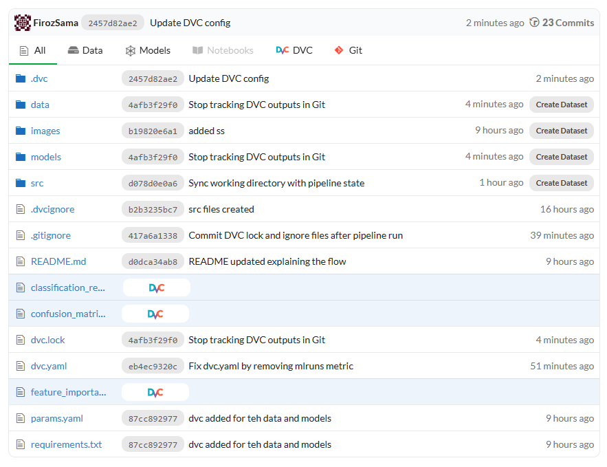
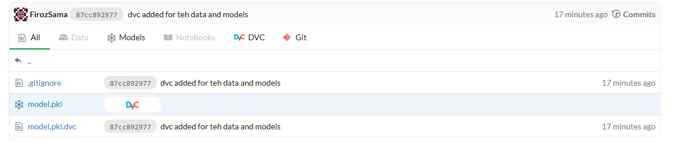
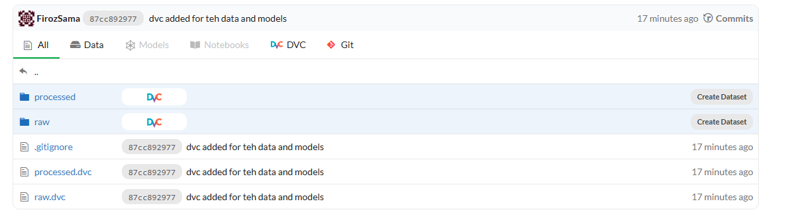
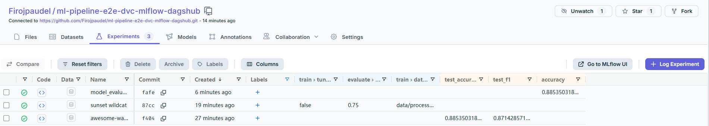

# ML Pipeline: Earthquake Tsunami Prediction with DVC, MLflow, and DAGsHub

This repository contains an end-to-end machine learning pipeline for binary classification of tsunami risks based on earthquake data. It uses DVC for data versioning, MLflow for experiment tracking, and DAGsHub for collaboration. The project is built using the `earthquake_data_tsunami.csv` dataset from Kaggle[](https://www.kaggle.com/datasets/ahmeduzaki/global-earthquake-tsunami-risk-assessment-dataset) as a learning exercise to understand and implement an MLOps workflow. The pipeline is developed and run entirely in GitHub Codespaces, providing a convenient cloud-based environment.

---

## Project Overview

### Objective
- **Task**: Binary classification to predict tsunami occurrences from earthquake data.
- **Dataset**: `earthquake_data_tsunami.csv` from Kaggle, containing global earthquake and tsunami-related features.
- **Purpose**: A practical learning project to master DVC, MLflow, and DAGsHub integration.

### Technologies
- **DVC**: Manages data and model versioning.
- **MLflow**: Tracks experiments and model metrics.
- **DAGsHub**: Hosts the repository and provides remote storage and tracking.
- **GitHub Codespaces**: Used for development, offering a pre-configured cloud environment.

---

## Screenshots

The following images illustrate key aspects of the pipeline as seen on DAGsHub:

1. **Initial Repository and Pipeline**  
   Shows the initial repository files and data pipeline structure.  
   <div align="center">
    
   </div>

2. **Model.pkl Stored with DVC**  
   Displays the `model.pkl` file tracked by DVC on DAGsHub.  
   <div align="center">
    
   </div>

3. **Raw and Processed Data with DVC**  
   Highlights the `data/raw` and `data/processed` folders managed by DVC.  
   <div align="center">
    
   </div>

4. **Experiments Section**  
   Shows the MLflow experiments page with tracked runs.  
   <div align="center">
    
   </div>

---

## Setup and Usage

### Prerequisites
- Install dependencies: `pip install -r requirements.txt`
- Set up DAGsHub: Run `dagshub login` with your token.
- Configure MLflow: Add `MLFLOW_TRACKING_URI` in a `.env` file (e.g., `https://dagshub.com/YOUR_USERNAME/YOUR_REPO.mlflow`).

### Running the Pipeline
1. Initialize DVC: `dvc init`
2. Track data and models: `dvc add data/processed/*.csv models/model.pkl`
3. Push to DAGsHub: `dvc push`
4. Run the pipeline: `dvc repro`
5. Push code changes: `git push`

### Experimentation
- Modify `params.yaml` (e.g., adjust `n_estimators` or `max_depth`).
- Commit changes: `git add params.yaml && git commit -m "Update params"`
- Re-run: `dvc repro` and `dvc push`

---

## Project Structure

``` bash
.
├── README.md
├── data
│   ├── processed
│   │   ├── X_test.csv
│   │   ├── X_train.csv
│   │   ├── y_test.csv
│   │   └── y_train.csv
│   └── raw
│       └── earthquake_data_tsunami.csv
├── params.yaml
├── requirements.txt
├── src
│   ├── init.py
│   ├── eval.py
│   ├── train.py
├── dvc.yaml
└── .gitignore
```
---

## Notes
- The pipeline is designed for learning purposes and can be extended for production use.
- All data and model files are versioned with DVC and stored on DAGsHub.
- MLflow experiments are tracked and viewable on the DAGsHub UI.

---

## Acknowledgments
- Dataset source: [Kaggle - Global Earthquake Tsunami Risk Assessment](https://www.kaggle.com/datasets/ahmeduzaki/global-earthquake-tsunami-risk-assessment-dataset)
- Development environment: GitHub Codespaces 

> (yes its makes easier to make venv in codespaces. No space occupied)